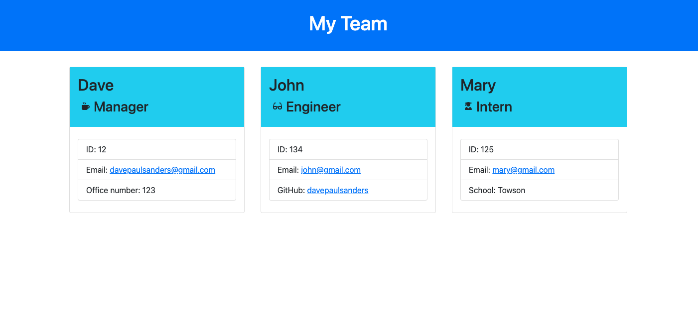

# Team Profile Generator

This project uses Node to build an index.html file based off responses to prompts in the terminal using the Inquirer module.

## Installation

Install this program by cloning the repository, navigating to the project root directory and entering `npm install` into the terminal to install required dependencies.

## Testing

To run tests, navigate to the root directory of the project in your terminal and type `npm test`.

## Usage

Run this program by navigating to the project root directory and entering `node index` into the terminal. Answer the prompts and an index.html file will be generated in the dist folder.

## Screenshots

## Walkthrough Video

[Link to video](https://drive.google.com/file/d/1WL67B54l91DJjdAdmPt8ry_0ZOh5IRZu/view)
